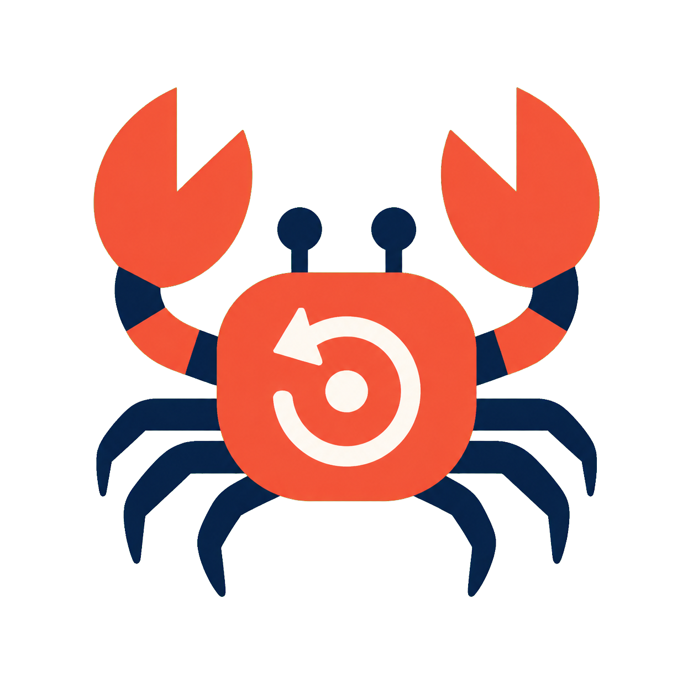

<p align="center">
  
</p>

<h1 align="center">Crab</h1>

<p align="center"><strong>给长时间运行的 AI Agent 真正可恢复的存档点，而不只是聊天记录。</strong></p>

<p align="center">
  <a href="https://github.com/open-agent-infra/crab/actions/workflows/ci.yml"></a>
  <a href="LICENSE"></a>
  <a href="https://arxiv.org/abs/2604.28138"></a>
</p>

<p align="center"><a href="README.md">English</a> · 简体中文</p>

AI Agent 不只是在交换消息。它会修改代码仓库、安装依赖、启动后台服务、编译程序，并在数百次工具调用中持续积累状态。当 workflow 崩溃，或者 Agent 走错一步时，单纯重放对话并不能重建它当时工作的环境。

Crab 让整个 Agent sandbox 变得可恢复。它观察每个 Agent turn，判断这一轮改变了文件系统、进程状态、两者，还是没有产生需要恢复的状态，并在正确的时机创建粒度最小但完整的 checkpoint。

于是，一个 Agent workflow 可以继续运行、回滚、分支或迁移，而不必从头开始。

## 为什么需要 Crab？

现有恢复方案通常迫使用户在正确性和成本之间二选一：

| 方案 | 保存了什么 | 问题在哪里 |
| --- | --- | --- |
| 应用/Agent 框架级 checkpoint（例如 Claude Code checkpoint 或 LangGraph persistence） | 对话历史，以及部分 Git 或文件变化 | 恢复后缺少已安装的软件包、后台进程、内存服务和 shell 产生的系统副作用 |
| 重启并重放 | 最终可以重新构建环境 | 必须重复此前的模型推理和工具调用，浪费时间、token 和外部资源 |
| 每轮完整保存容器或 VM（例如 Docker/runc 或基于 Firecracker 的 sandbox） | 完整执行状态 | 把每一轮都当成同等重要的有状态操作，高密度部署时产生难以承受的 checkpoint I/O |
| **Crab** | **在 Agent turn 边界自适应保存文件系统和进程状态** | **保留完整恢复点，同时跳过不必要的 checkpoint 工作** |

Crab 不替代 Claude Code、Codex、LangGraph、Docker 或 cloud sandbox。它在 Agent workflow 与执行 substrate 之间增加恢复层，让现有 Agent 获得完整而高效的 savepoint。

根本问题是 **Agent–OS semantic gap（智能体与操作系统之间的语义鸿沟）**：

- Agent 框架知道模型 turn 和 tool call，但看不到它们完整的操作系统副作用；
- 操作系统看得到进程和文件活动，却不知道这些变化属于哪个 Agent turn，也不知道它们是否与恢复有关。

Crab 把这两层信息关联起来：在 turn 边界观察 OS-visible effects，选择跳过、仅文件系统、仅进程或完整 checkpoint，并把 checkpoint 工作与 Agent 等待下一次 LLM 响应的时间重叠。在单机高密度部署中，它还会统一调度多个 sandbox 的 checkpoint，避免共享存储被瞬时流量压垮。

Crab 不需要改变 Agent 的工具循环，也不需要让 CRIU、ZFS 或其他 checkpoint backend 理解 Agent。

## 它会怎样改变 Agent workflow？

| 没有 Crab | 使用 Crab |
| --- | --- |
| 崩溃后从头重跑长任务 | 从最近一个完整 sandbox checkpoint 继续 |
| 错误命令之后靠一串脆弱的清理命令补救 | 将 sandbox 直接回滚到已知正确状态 |
| 每轮完整 snapshot 带来大量 I/O | 跳过无状态 turn，有状态 turn 只保存所需粒度 |
| rollout 分支必须重放共同前缀 | 从中间 sandbox 状态开始新的探索分支 |
| Spot 实例回收会丢失进行中的工作 | 保存并在替代计算资源上恢复 sandbox |

对个人开发者，Crab 提供围绕 coding agent 和 shell agent 的 CLI/SDK savepoint。对 Agent 平台，Crab 是连接 Agent 语义与底层 checkpoint substrate 的策略和协调层。

## 实验结果

在 [Crab 论文](https://arxiv.org/abs/2604.28138)中，我们使用 Claude Code、iFlow CLI 和 SWE-agent，在 Terminal-Bench 与 SWE-Bench workload 上进行了评估。Crab：

- 将恢复正确率从 chat-only 的 **8% 提升到 100%**；
- 因为大部分 turn 没有改变恢复相关状态，最多跳过 **87% 的 checkpoint 工作**；
- 即使在高密度 sandbox 部署下，也保持在无故障、无 checkpoint 执行时间的 **1.9% 以内**；
- 当 rollback 作为工具直接暴露给 Agent 时，最多减少 **29% wall-clock time** 和 **36% rollback token**；
- 通过复用中间状态，为分支 RL rollout 减少 **40.0–64.2%** 的重复 token。

## 工作原理

Crab 组合了任何单一层都不具备的三种视角：

1. **Coordinator** 识别 Agent turn 边界，并将 LLM 等待时间用作异步 checkpoint 窗口。
2. 基于 eBPF 的 **Inspector** 观察与恢复有关的进程和文件系统变化，决定 checkpoint 粒度。
3. Host-scoped **C/R Engine** 使用已有 runtime/storage backend，在多个 sandbox 之间调度、创建、记录和恢复 checkpoint。

v0 使用 `runc` 管理 sandbox 生命周期、CRIU 保存进程状态、ZFS 创建文件系统 snapshot，并由 eBPF host inspector 检测状态变化。Crab 是控制和协调层：它负责回答**何时保存**以及**保存什么粒度**，而不是把这些策略写死在某个 C/R 实现里。

## 立即体验

在 Ubuntu 24.04/26.04 x86-64 主机上：

```bash
git clone https://github.com/open-agent-infra/crab.git
cd crab
sudo ./scripts/install-ubuntu.sh
sudo ./scripts/smoke-rollback.sh
```

安装器会创建一个名为 `crab` 的专用 sparse-file ZFS pool；它不会选择任意已有 pool，也不会对磁盘重新分区。Smoke demo 不需要模型 API key：它会启动 Ubuntu sandbox，保存正在运行的进程和文件状态，破坏二者，再恢复 checkpoint 并验证原始状态已经回来。

安装选项见[安装文档](docs/installation.md)，逐步说明见[快速上手](docs/getting-started.md)。

## 手动创建 checkpoint 和回滚

```bash
sudo crab daemon start --config /etc/crab/config.yaml
SBX=$(sudo crab sandbox run --detach ubuntu:22.04)

sudo crab sandbox exec "$SBX" -- sh -lc 'echo before > /root/state.txt'
CKPT=$(sudo crab checkpoint create "$SBX")
sudo crab checkpoint ls "$SBX"

sudo crab sandbox exec "$SBX" -- sh -lc 'echo after > /root/state.txt'
sudo crab restore "$SBX" "$CKPT"
sudo crab sandbox exec "$SBX" -- cat /root/state.txt
# before

sudo crab sandbox rm "$SBX"
sudo crab daemon stop
```

## Python SDK

```python
from crab import Engine, Sandbox

with Engine.connect() as engine:
    sandbox = Sandbox(image="ubuntu:22.04", engine=engine)
    try:
        sandbox.commands.run("echo before > /root/state.txt")
        checkpoint = sandbox.checkpoint(label="before-change")
        sandbox.commands.run("echo after > /root/state.txt")
        sandbox.restore(checkpoint)
    finally:
        sandbox.kill()
```

Crab 提供 `Agent` integration contract，以及内置的 Claude Code 和 iFlow profile。参见 [SDK 指南](docs/sdk.md)、[接入自己的 Agent](docs/byo-agent.md)，以及不需要模型 API key 的[真实 iFlow trace replay](docs/sdk-iflow-replay.md)。

## Checkpoint 边界

v0 full checkpoint 覆盖进程状态和 sandbox 中由 ZFS 支持的 root filesystem。Host bind mount 不在 snapshot 范围内。

`Sandbox(work_dir="./repo")` 和 `crab sandbox run --work-dir` 会把 host 目录挂载到 `/work`；Crab checkpoint 不会回滚这个 host 目录。如果希望 Crab 保护项目文件，请将仓库 clone 或复制到 sandbox root filesystem 内。

Crab 也无法撤销 sandbox 外部的副作用，例如 GitHub push、云 API 调用、支付或外部数据库写入。

## v0 Technical Preview

当前版本支持 Ubuntu 24.04/26.04 x86-64、root-owned 单用户 daemon、CLI/SDK 手动恢复、基于语义的自动 checkpoint，以及 runc + CRIU + ZFS backend。

下一阶段包括更多 checkpoint substrate、rootless/multi-user、daemon 重启后的 sandbox rehydration，以及封装好的 Agent-facing rollback tool/skill。当前版本优先提供一条完整、真实、可验证的 backend 路径。

## 文档与贡献

[文档索引](docs/README.md)包括安装、CLI/SDK、Agent 接入、配置、架构和 telemetry。设计与评估详见[论文](https://arxiv.org/abs/2604.28138)。

欢迎贡献。开发和测试要求见 [CONTRIBUTING.md](CONTRIBUTING.md)，replay example 内置 runtime archive 的来源见 [THIRD_PARTY_NOTICES.md](THIRD_PARTY_NOTICES.md)。

## 开发

```bash
python3 -m venv .venv
.venv/bin/pip install -e .
.venv/bin/python -m unittest -v \
  tests.test_remote_engine_checkpoint \
  tests.test_image_runtime \
  tests.test_sdk_sandbox \
  tests.test_iflow_trace_replay
```

Real-host 测试还需要 `scripts/install-ubuntu.sh` 安装的系统依赖。Benchmark dataset 和 recorded trace 不属于普通安装路径。

## License

Crab 使用 [MIT License](LICENSE)。内置第三方组件保留其原始许可证，详见 [THIRD_PARTY_NOTICES.md](THIRD_PARTY_NOTICES.md)。
