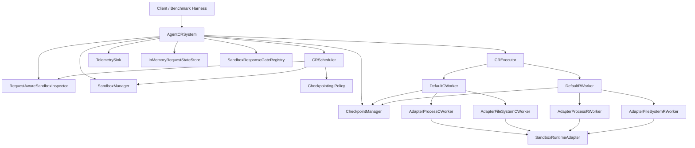

# Agent-CR Architecture

This document describes the code paths that exist in the current repository, not the earlier design snapshots.

## High-Level Shape

`build_default_system(...)` assembles this graph with in-process implementations. Real-host tests and benchmarks often bypass the builder and wire the same pieces directly so they can control runtime paths, sandbox metadata directories, retention wrappers, and scheduler policies.

## Runtime Modes

### Docker test path

- `build_default_system(runtime="docker")` creates `DockerRuntimeAdapter` and `InMemorySandboxManager`.
- The adapter reports command shapes for checkpoint and restore, but does not execute a real runtime implementation.
- This path is mainly for unit tests and simulated end-to-end tests.

### Real `runc` path

- `build_default_system(runtime="runc")` creates `RuncRuntimeAdapter` and `RuncSandboxManager`.
- Real-host scenarios also construct these directly with explicit `RuncRuntimePaths` and `RuncSandboxManagerPaths`.
- Process state is handled through `runc checkpoint` and `runc restore` backed by CRIU image directories.
- Filesystem state is handled through ZFS snapshots and rollbacks.

## Request Interception And Checkpoint Coordination

The request-aware flow is built from these pieces:

- `AgentCRRequestInterceptor` or `AgentCRRequestInterceptorServer`
- `InMemoryRequestStateStore`
- `SandboxResponseGateRegistry`
- `RequestAwareSandboxInspector`
- `AgentCRSystem.start()`

Flow:

1. The interceptor sees an outbound LLM request from a sandbox.
2. It records request state in `InMemoryRequestStateStore`.
3. If response gating is enabled, it arms `SandboxResponseGateRegistry` with the sandbox ID and request ID.
4. The interceptor notifies `AgentCRSystem.notify_interceptor_state_change(...)`.
5. The system monitor loop observes the request start and dispatches coordination for that sandbox.
6. `_execute_checkpoint_flow(...)` asks `CRScheduler` whether a checkpoint should run.
7. If a checkpoint runs while the request is still in flight and the pending gate matches, `_build_checkpoint_metadata(...)` stores live-request metadata in the checkpoint manifest.

That metadata is what `_validate_restore_checkpoint(...)` inspects when restore validation is enabled.

## Manual Checkpoint Flow

`checkpoint_once(...)`:

1. Pause the sandbox through the sandbox manager.
2. Build a `CheckpointJob`.
3. Execute checkpoint work through `CRExecutor`.
4. `DefaultCWorker` runs process and filesystem checkpoint workers.
5. The workers write artifacts through the checkpoint manager and produce a `CheckpointManifest`.
6. On success, scheduler and inspector checkpoint timestamps are updated.
7. The sandbox is resumed when the policy or runtime path expects it.

`checkpoint_if_due(...)` shares the same execution path after the scheduler decision, but does not force a checkpoint if the policy declines.

## Restore Flow

`restore_once(...)`:

1. Convert the requested checkpoint ID to `CheckpointId`.
2. If `enforce_restore_checkpoint_validation=True`, call `_validate_restore_checkpoint(...)` before mutating the sandbox.
3. Ask the sandbox manager to prepare for restore.
4. Create a `RestoreJob`.
5. `CRExecutor` dispatches to `DefaultRWorker`.
6. `DefaultRWorker` resolves the effective restore manifest and restores filesystem state before process state.
7. On success, the sandbox manager marks the sandbox as restored and storage receives `handle_restore_complete(...)`.

Manifest resolution is important because restore may depend on artifacts from earlier checkpoints. `resolve_restore_manifest(...)` merges the effective process and filesystem artifacts before restore workers run.

## Recovery Loop

`AgentCRSystem.start()` launches a recovery thread that consumes queued `RecoveryEvent` records.

### Fault recovery

1. `notify_fault(...)` enqueues a `fault` event.
2. `_handle_recovery_event(...)` tries to choose a checkpoint via `_select_recovery_checkpoint(...)`.
3. If a checkpoint is found, the system restores it.
4. If restore succeeds, the recovery record is marked `restored`.
5. If restore fails and a `relaunch_handler` exists, the handler is invoked and the record is marked `relaunched`.
6. If no checkpoint is usable and no relaunch handler exists, the record is marked `no_checkpoint`.

### Preemption recovery

1. `notify_preemption(...)` stores preemption metadata in the current snapshot and enqueues a `preemption` event.
2. `_handle_recovery_event(...)` first attempts a checkpoint using the configured preemption policy.
3. If that checkpoint succeeds, the new checkpoint is restored.
4. If it does not, recovery falls back to checkpoint selection and then to relaunch behavior just like fault recovery.
5. The temporary preemption metadata is cleared at the end of handling.

## Checkpoint Selection And Response Release

`_select_recovery_checkpoint(...)` scans checkpoints newest-first.

- Default behavior: validation is disabled, so the newest checkpoint is selected immediately.
- Strict behavior: when `enforce_restore_checkpoint_validation=True`, each candidate is checked with `_validate_restore_checkpoint(...)`.
- Live-request checkpoints that no longer match the pending gate are skipped.
- If no checkpoint satisfies validation, recovery emits telemetry for the failure to find a satisfiable checkpoint.

After a successful restore, `_release_checkpoint_response_gate(...)` checks whether the restored checkpoint captured an in-flight request and whether the current pending gate still matches that request ID. If it does, the buffered interceptor response is released so the restored sandbox can continue the original request path.

## Storage And Retention

The current storage path is filesystem-backed:

- `LocalCheckpointManager` stores manifests and artifacts under the configured root.
- Retention wrappers adjust checkpoint lifetime without changing restore semantics:
  - `KeepAllCheckpointManager`
  - `LatestOnlyCheckpointManager`
  - `DeleteAfterRestoreCheckpointManager`

Checkpoint manifests include runtime metadata, artifact references, and an integrity hash. The restore path consumes the manifest model directly; there is no separate external control plane in this repository.

## Benchmark Harness

The real-host benchmarks share `RealHostScenarioHarness` in [benchmarks/real_host_scenario_base.py](/root/workspace/agent-cr/benchmarks/real_host_scenario_base.py).

That harness:

- Builds the simulated agent image
- Creates a temporary ZFS pool
- Launches `runc` sandboxes
- Runs an interceptor server in front of the simulated LLM service
- Wires `AgentCRSystem` with policy-specific retention and recovery settings
- Exposes helpers for checkpoint, restore, fault injection, preemption injection, and checkpoint cloning for tree-search fan-out

The main benchmark entrypoints and configuration surface are:

- [benchmarks/run.py](/root/workspace/agent-cr/benchmarks/run.py)
- [benchmarks/config.py](/root/workspace/agent-cr/benchmarks/config.py)
- [benchmarks/scenarios/fault.py](/root/workspace/agent-cr/benchmarks/scenarios/fault.py)
- [benchmarks/scenarios/spot.py](/root/workspace/agent-cr/benchmarks/scenarios/spot.py)
- [benchmarks/scenarios/tree.py](/root/workspace/agent-cr/benchmarks/scenarios/tree.py)
- [benchmarks/scenarios/e2e.py](/root/workspace/agent-cr/benchmarks/scenarios/e2e.py)
