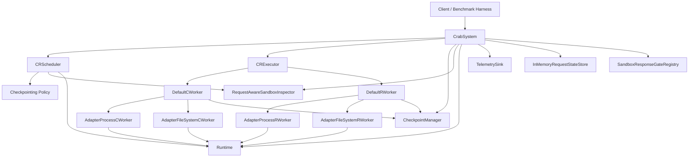

# Crab Architecture

This document describes the code paths that exist in the current repository, not the earlier design snapshots.

## High-Level Shape

`build_default_system(...)` assembles this graph with in-process implementations. Real-host tests and benchmarks often bypass the builder and wire the same pieces directly so they can control runtime paths, retention wrappers, and scheduler policies.

## Runtime Modes

### Docker test path

- `build_default_system(runtime="docker")` creates `InMemoryRuntime`.
- The in-memory runtime reports command shapes for checkpoint and restore, but does not execute a real runtime implementation.
- This path is mainly for unit tests and simulated end-to-end tests.

### Real `runc` path

- `build_default_system(runtime="runc")` creates `RuncRuntime`.
- Real-host scenarios also construct this directly with explicit `RuncRuntimePaths`.
- Process state is handled through `runc checkpoint` and `runc restore` backed by CRIU image directories.
- Filesystem state is handled through a pluggable `FilesystemProvider`
  (`crab/runtime/fs_provider.py`). The default `ZfsProvider` maps
  checkpoints to ZFS snapshots/rollbacks/clones; the `BtrfsProvider`
  maps them to btrfs subvolume snapshots with an emulated rollback
  (trash-swap) and needs no `promote` because btrfs snapshots carry no
  clone-origin dependency. The `OverlayProvider` mounts the rootfs as
  overlayfs — lowerdir is the shared image content (one copy per image,
  page-cache shared across fork fleets), upperdir+workdir live in one
  per-sandbox btrfs subvolume that inherits the btrfs snapshot/fork
  mechanics, and the upperdir doubles as a native changeset source
  (whiteouts and opaque markers are decoded into container semantics).
  Select the backend with `filesystem_backend`.

## Request Interception And Checkpoint Coordination

The request-aware flow is built from these pieces:

- `CrabRequestInterceptor` or `CrabRequestInterceptorServer`
- `InMemoryRequestStateStore`
- `SandboxResponseGateRegistry`
- `RequestAwareSandboxInspector`
- `CrabSystem.start()`

Flow:

1. The interceptor sees an outbound LLM request from a sandbox.
2. It records request state in `InMemoryRequestStateStore`.
3. If response gating is enabled for that request, it arms `SandboxResponseGateRegistry` with the sandbox ID, request ID, and a monotonically increasing request generation.
4. The interceptor notifies `CrabSystem.notify_interceptor_state_change(...)`.
5. The system monitor loop coordinates pending gated requests for that sandbox generation by generation and keeps looping until no pending request remains.
6. `_execute_checkpoint_flow(...)` asks `CRScheduler` whether a checkpoint should run for the current pending request generation.
7. If a checkpoint runs while the request is still in flight and the pending gate matches, `_build_checkpoint_metadata(...)` stores live-request metadata in the checkpoint manifest, including the request generation.

For Claude Code replay, the interceptor now classifies requests as `main_loop`, `helper`, or `count_tokens`. Only `main_loop` requests participate in response gating and live-request checkpoint capture. Auxiliary Claude requests still produce request telemetry and service responses, but they do not create scheduler-visible checkpoint windows.

That metadata is what `_validate_restore_checkpoint(...)` inspects when restore validation is enabled.

Two invariants matter here:

- a buffered response is not released until the matching request generation's coordination pass has finished and any submitted checkpoint has completed or been skipped
- releasing an older pending request does not release a newer pending request from the same sandbox

## Manual Checkpoint Flow

`checkpoint_once(...)`:

1. Pause the sandbox through the runtime.
2. Build a `CheckpointJob`.
3. Execute checkpoint work through `CRExecutor`.
4. `DefaultCWorker` runs process and filesystem checkpoint workers.
5. The workers write artifacts through the checkpoint manager and produce a `CheckpointManifest`.
6. On success, scheduler and inspector checkpoint timestamps are updated.
7. The sandbox is resumed when the policy or runtime path expects it.

`checkpoint_if_due(...)` shares the same execution path after the scheduler decision, but does not force a checkpoint if the policy declines.

## Requested Logical Checkpoint Flow

`commands.run(checkpoint=True)` and sandbox-level `auto_checkpoint` use
`checkpoint_requested(...)`, not the force-full manual path:

1. The SDK preallocates a logical `checkpoint_id` and returns it in an
   `AsyncCheckpoint` handle as soon as exec/observe completes.
2. The daemon serializes the background request with later actions and asks
   `CRScheduler.query_requested_checkpoint(...)` for an inspector-driven
   materialization decision.
3. With no previous restorable state, Crab creates a full baseline. With
   filesystem-only changes it creates a partial filesystem checkpoint. With a
   process change it captures process + filesystem state (and may use the
   configured incremental process representation). A clean turn creates no
   physical data.
4. Every successful turn persists a manifest under the logical id. A clean
   turn's manifest has no artifacts and explicitly records
   `process_restore_checkpoint_id` and `filesystem_restore_checkpoint_id` for
   the physical sources it reuses.
5. Restore, fork, changeset, retention, and deletion resolve or protect those
   explicit component dependencies. The async job is successful only after a
   restorable manifest exists; a failed worker result is surfaced as a failed
   job rather than a false completion.

Restore also moves the sandbox's in-memory component-source cursor to the
restored logical point. This matters when newer manifests remain on disk: a
clean checkpoint after rolling back to A must reuse A, not the newer stored B.
The restored process source becomes the scheduler's next incremental parent.

Automatic interval and LLM-window gates do not apply to requested logical
points: once the inspector reports changed state, skipping physical work would
make the logical id refer to the wrong state. The interval policy remains in
effect for `checkpoint_if_due(...)`. Explicit `sandbox.checkpoint()` /
`checkpoint_once(...)` remains the force-full escape hatch.

## Scheduler Inspection Modes

`CRScheduler.query_checkpoint(...)` now has two inspection paths:

- Default: pause the sandbox first, then inspect and evaluate. This is the safe path and is controlled by `SchedulerConfig.inspect_without_pause=False`.
- Opt-in live inspection: inspect first and only pause later if evaluation decides that a non-`leave_running` checkpoint needs quiescing. This is controlled by `SchedulerConfig.inspect_without_pause=True`.

The benchmark YAML `scheduler:` block can override that flag, but the repository defaults remain on the paused-inspection path.

## Incremental Process Checkpoint Chains

Enabled by default via `SchedulerConfig.incremental_process_enabled=True` for runtimes that advertise incremental-process support. Operators can disable it for high-dirty-memory workloads. When enabled, the scheduler's decision passes a `produce_pre_dump=True` flag down to the worker for every chain participant — anchors and chain nodes alike. The flag travels on `SchedulerCheckpointDecision` and `CheckpointJob`, separate from `is_incremental_process` (which discriminates "this checkpoint chains off a parent's pre-dump" from "this is a chain root").

`AdapterProcessCWorker.checkpoint(...)` runs a two-phase CRIU dance whenever `produce_pre_dump=True` and the runtime advertises `supports_incremental_process=True`:

1. `runtime.pre_dump_process(sandbox_id, ckpt, parent_checkpoint_id=...)` writes `<ckpt>/pre_dump/`. If `parent_checkpoint_id` is set, the command carries `--parent-path ../<parent>/pre_dump` and only dirty pages are written; if `parent_checkpoint_id` is `None`, the pre-dump dumps full memory and starts a new chain.
2. `runtime.checkpoint_process(sandbox_id, ckpt, leave_running=..., parent_checkpoint_id=ckpt)` writes `<ckpt>/process/` with `--parent-path ../pre_dump`. This is the restorable artifact — it always chains off the just-taken sibling pre-dump, regardless of whether step 1 had a parent.

Anchors and chain nodes therefore write the same on-disk shape (`pre_dump/` + `process/`); they differ only in whether step 1 had a parent. `process_kind` on the manifest is `"incremental"` only when the manifest's `parent_checkpoint_id` is set; anchors stay `"full"` so the chain validator can stop walking at them.

The scheduler's `InMemorySchedulerStateStore` tracks `last_process_checkpoint_id` and `process_chain_length` per sandbox. `_resolve_incremental_process(...)` consults the store after the policy decides:

- no last process checkpoint → emit an anchor (`produce_pre_dump=True`, no parent)
- `chain_length + 1 >= full_process_checkpoint_interval` or `>= max_process_chain_length` → emit a fresh anchor and reset the chain length to 0
- otherwise → emit a chain node (`is_incremental_process=True`, `parent_process_checkpoint_id=last_id`)

`mark_checkpoint_complete(...)` records each successful process checkpoint. The chain length resets to 0 on anchors and increments on nodes.

Before selecting a chain node, the scheduler verifies that the runtime supports
incremental process checkpoints and that the candidate parent's `pre_dump/`
directory still exists. The system rechecks both the stored parent manifest
and runtime directory at the execution boundary. A manual/legacy standalone
full checkpoint or a removed parent therefore starts a fresh anchor instead
of producing a dangling incremental manifest. Restoring an incremental point
reconstructs its persisted chain depth so the configured interval and maximum
remain accurate after historical restores.

### Restore-time chain validation

`_validate_incremental_chain(...)` in `workers/composite.py` runs before `DefaultRWorker` invokes `runc restore`. It loads the target manifest and walks `parent_checkpoint_id` toward the chain root. For each ancestor it confirms that the `pre_dump/` directory still exists on disk via `runtime.pre_dump_location(...)`. A missing intermediate dir raises `FileNotFoundError` with the missing checkpoint id; the restore returns `FailureCode.STORAGE_ERROR` rather than letting CRIU silently produce a corrupt restore.

Validation is a no-op on full manifests (anchors / non-incremental checkpoints) and on runtimes that advertise `supports_incremental_process=False`.

### Retention

Two new contracts on `CheckpointManager`:

- `descendants(sandbox_id, checkpoint_id) -> list[CheckpointId]` — transitive descendants whose `parent_checkpoint_id` chain bottoms out at `checkpoint_id`, returned newest-first.
- `delete_checkpoint(..., cascade: bool = False)` — refuses to drop a parent with live descendants unless `cascade=True`; cascading deletes leaves first so children never end up orphaned.

`LocalCheckpointManager.delete_all_checkpoints(...)` iterates `reversed(list_checkpoints(...))` so the descendants check passes without needing cascade.

`DelegatingCheckpointManager._protected_checkpoint_ids(...)` (the base class for `LatestOnlyCheckpointManager` and `DeleteAfterRestoreCheckpointManager`) walks `parent_checkpoint_id` from each protected id and adds every ancestor to the protected set. As a result, `LatestOnlyCheckpointManager` keeps the entire chain back to its anchor on disk while it is the latest checkpoint; once the active chain advances past an old chain (e.g. after a chain reset), the old chain falls out of the protected set and `_prune_unprotected(...)` evicts it leaf-first.

`KeepAllCheckpointManager` is unaffected — it never deletes anything. `DeleteAfterRestoreCheckpointManager` already iterated newest-first on restore-complete, so it is implicitly safe.

## Restore Flow

`restore_once(...)`:

1. Convert the requested checkpoint ID to `CheckpointId`.
2. If `enforce_restore_checkpoint_validation=True`, call `_validate_restore_checkpoint(...)` before mutating the sandbox.
3. Ask the runtime to prepare for restore.
4. Create a `RestoreJob`.
5. `CRExecutor` dispatches to `DefaultRWorker`.
6. `DefaultRWorker` resolves the effective restore manifest and restores filesystem state before process state.
7. On success, the runtime marks the sandbox as restored and storage receives `handle_restore_complete(...)`.

Manifest resolution is important because restore may depend on artifacts from earlier checkpoints. `resolve_restore_manifest(...)` merges the effective process and filesystem artifacts before restore workers run.

## Fork Promotion And Network Identity

`_promote_fork_onto_source(...)` is the shared swap behind a fork-backed
`commit()` (B3) and a promoting `merge_processes` (C4): it restores a
fork's checkpoint onto the source's unchanged sandbox id.

When sandbox networking is on, the fork runs in its own network namespace
with its own lease, so its dumped sockets are bound to the fork's guest
IP. Restoring that image into the source's namespace fails in CRIU's
`soccr` with `EADDRNOTAVAIL`, so the source **adopts the fork's network
identity** instead. The engine hook `transfer_network_lease(...)` moves
three things together, and treating them as one operation is the point:

1. the lease record is re-keyed from the fork id to the source id
   (`BenchmarkNetworkManager.transfer_lease`, pop-before-rekey so the
   release of the source's old lease never tears down the netns just
   moved in);
2. the source bundle's `config.json` network namespace path is retargeted
   to the fork's netns;
3. the source's runtime metadata (`guest_ip`, `network_namespace_path`)
   is rewritten, because the interceptor's attribution fallback and
   `Sandbox.get_host` read it — a transfer that fixed only the lease would
   pass socket checks while silently misattributing egress.

The swap runs in two phases so nothing irreversible precedes a detectable
failure. A pre-flight probe (before the source is stopped) decides whether
a transfer applies and checks the source bundle exists; the transfer path
then dumps the fork **stopped** (two live copies of a listener cannot
share one netns) and, after the dump, fails loud rather than silently
falling back to the lease-repair path — a fork-addressed image restored
into the source's own netns would fail with the root cause buried. The
source's `sandbox_id` never changes; its guest IP does. Networking-off
promotions keep the fork running and use `lease_repair` unchanged.

## Recovery Loop

`CrabSystem.start()` launches a recovery thread that consumes queued `RecoveryEvent` records.

### Fault recovery

1. `notify_fault(...)` enqueues a `fault` event.
2. `_handle_recovery_event(...)` tries to choose a checkpoint via `_select_recovery_checkpoint(...)`.
3. If a checkpoint is found, the system restores it.
4. If restore succeeds, the recovery record is marked `restored`.
5. If restore fails, the error remains visible by default. Relaunch fallback is
   used only when both a `relaunch_handler` exists and
   `relaunch_on_restore_failure=True`.
6. If no checkpoint is usable, the record is marked `no_checkpoint` unless
   the same explicit relaunch fallback is enabled.

### Preemption recovery

1. `notify_preemption(...)` stores preemption metadata in the current snapshot and enqueues a `preemption` event.
2. `_handle_recovery_event(...)` first attempts a checkpoint using the configured preemption policy.
3. If that checkpoint succeeds, the new checkpoint is restored.
4. If it does not, recovery falls back to checkpoint selection and then uses
   the same opt-in relaunch behavior as fault recovery.
5. The temporary preemption metadata is cleared at the end of handling.

## Checkpoint Selection And Response Release

`_select_recovery_checkpoint(...)` scans checkpoints newest-first.

- Default behavior: validation is disabled, so the newest checkpoint is selected immediately.
- Strict behavior: when `enforce_restore_checkpoint_validation=True`, each candidate is checked with `_validate_restore_checkpoint(...)`.
- Live-request checkpoints that no longer match the pending gated request generation are skipped.
- If no checkpoint satisfies validation, recovery emits telemetry for the failure to find a satisfiable checkpoint.

After a successful restore, `_release_checkpoint_response_gate(...)` checks whether the restored checkpoint captured an in-flight request and whether the current pending gate still matches that request ID and generation. If it does, the buffered interceptor response is released so the restored sandbox can continue the original request path without releasing a newer pending request by mistake.

## Storage And Retention

The current storage path is filesystem-backed:

- `LocalCheckpointManager` stores manifests and artifacts under the configured root.
- Retention wrappers adjust checkpoint lifetime without changing restore semantics:
  - `KeepAllCheckpointManager`
  - `LatestOnlyCheckpointManager`
  - `DeleteAfterRestoreCheckpointManager`

Checkpoint manifests include runtime metadata, artifact references, and an integrity hash. The restore path consumes the manifest model directly; there is no separate external control plane in this repository.

## Benchmark Harness

The research harness remains under `benchmarks/` and wires the same scheduler,
executor, runtime, inspector, and storage components with experiment-specific
policies. It is not part of the public sandbox API or the one-command install
path.

Run-specific benchmark analyses and configuration catalogs have been moved to
[`legacy/docs/`](../legacy/docs/). They may explain why a mechanism exists,
but they should not be treated as current operator guidance.
