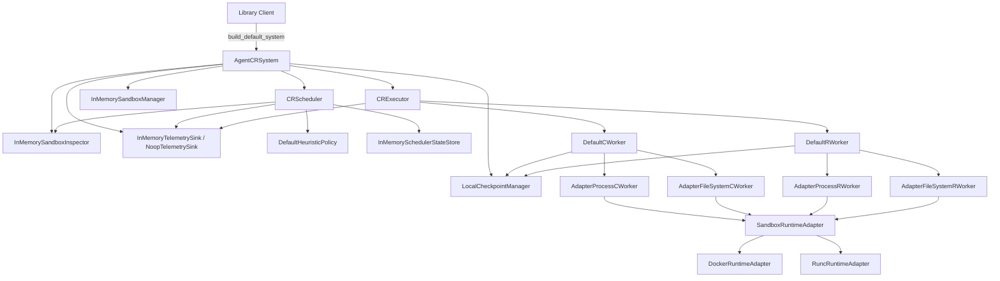

# Agent-CR Current Architecture

This document describes the architecture of the current `agent_cr` implementation (interface-first v1, dry-run runtime behavior).

## High-Level Component Diagram

## Checkpoint and Restore Flow

### Checkpoint

1. `CRScheduler` gets `SandboxSnapshot` from `SandboxInspector`.
2. `CRPolicy` (`DefaultHeuristicPolicy`) returns `ScheduleDecision`.
3. If `should_checkpoint=True`, a `CheckpointJob` is queued in `InMemorySchedulerStateStore`.
4. `CRExecutor.run_checkpoint(...)` dispatches to `DefaultCWorker` using thread-pool workers.
5. `DefaultCWorker` calls:
   - `AdapterProcessCWorker` (process checkpoint planning)
   - `AdapterFileSystemCWorker` (filesystem checkpoint planning)
6. Workers call runtime adapter dry-run methods (`executed=False`) and produce artifacts.
7. `LocalCheckpointManager` stores artifacts and the `CheckpointManifest` (`v1` + integrity hash).
8. `CheckpointResult` is returned; scheduler can mark checkpoint complete.

### Restore

1. `CRExecutor.run_restore(...)` dispatches to `DefaultRWorker`.
2. `DefaultRWorker` loads manifest from `LocalCheckpointManager`.
3. It calls:
   - `AdapterProcessRWorker`
   - `AdapterFileSystemRWorker`
4. Both execute runtime dry-run restore planning (`executed=False`).
5. `RestoreResult` is returned with standardized status and telemetry.

## Data and Contracts

- IDs: `SandboxId`, `CheckpointId`, `JobId`.
- Job/Result types: `CheckpointJob`, `RestoreJob`, `CheckpointResult`, `RestoreResult`, `JobRecord`.
- Manifest: `CheckpointManifest` with:
  - `schema_version = v1`
  - runtime metadata
  - process/filesystem artifact references
  - integrity (`manifest_sha256`)
- Contracts are defined in `agent_cr/contracts.py` for all extension points.

## Runtime Behavior in v1

- Runtime adapters (`docker`, `runc`) are deterministic dry-run stubs.
- They return planned commands and metadata but do not execute real checkpoint/restore operations.
- Local storage (`LocalCheckpointManager`) is fully implemented.
- Scheduler/executor/inspector/sandbox manager default implementations are in-memory.

## Module Map

- System assembly: `agent_cr/system.py`
- Scheduling/state: `agent_cr/scheduler.py`
- Execution: `agent_cr/executor.py`
- Workers: `agent_cr/workers/`
- Runtime adapters: `agent_cr/runtime/`
- Storage: `agent_cr/storage/`
- Policies: `agent_cr/policy/`
- Domain models/config/ids: `agent_cr/models.py`, `agent_cr/config.py`, `agent_cr/ids.py`
- Telemetry/interceptor/sandbox lifecycle/inspector:
  - `agent_cr/telemetry.py`
  - `agent_cr/interceptor.py`
  - `agent_cr/sandbox_manager.py`
  - `agent_cr/inspector.py`

## Notes

- `legacy/` remains separate and untouched by this architecture.
- Benchmarks for this architecture are in `benchmarks/`.
- Tests for this architecture are in `tests/`.
