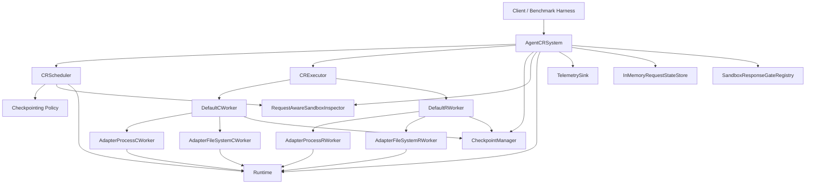

# Agent-CR Architecture

This document describes the code paths that exist in the current repository, not the earlier design snapshots.

## High-Level Shape

`build_default_system(...)` assembles this graph with in-process implementations. Real-host tests and benchmarks often bypass the builder and wire the same pieces directly so they can control runtime paths, retention wrappers, and scheduler policies.

## Runtime Modes

### Docker test path

- `build_default_system(runtime="docker")` creates `InMemoryRuntime`.
- The in-memory runtime reports command shapes for checkpoint and restore, but does not execute a real runtime implementation.
- This path is mainly for unit tests and simulated end-to-end tests.

### Real `runc` path

- `build_default_system(runtime="runc")` creates `RuncRuntime`.
- Real-host scenarios also construct this directly with explicit `RuncRuntimePaths`.
- Process state is handled through `runc checkpoint` and `runc restore` backed by CRIU image directories.
- Filesystem state is handled through ZFS snapshots and rollbacks.

## Request Interception And Checkpoint Coordination

The request-aware flow is built from these pieces:

- `AgentCRRequestInterceptor` or `AgentCRRequestInterceptorServer`
- `InMemoryRequestStateStore`
- `SandboxResponseGateRegistry`
- `RequestAwareSandboxInspector`
- `AgentCRSystem.start()`

Flow:

1. The interceptor sees an outbound LLM request from a sandbox.
2. It records request state in `InMemoryRequestStateStore`.
3. If response gating is enabled, it arms `SandboxResponseGateRegistry` with the sandbox ID, request ID, and a monotonically increasing request generation.
4. The interceptor notifies `AgentCRSystem.notify_interceptor_state_change(...)`.
5. The system monitor loop coordinates pending gated requests for that sandbox generation by generation and keeps looping until no pending request remains.
6. `_execute_checkpoint_flow(...)` asks `CRScheduler` whether a checkpoint should run for the current pending request generation.
7. If a checkpoint runs while the request is still in flight and the pending gate matches, `_build_checkpoint_metadata(...)` stores live-request metadata in the checkpoint manifest, including the request generation.

That metadata is what `_validate_restore_checkpoint(...)` inspects when restore validation is enabled.

Two invariants matter here:

- a buffered response is not released until the matching request generation's coordination pass has finished and any submitted checkpoint has completed or been skipped
- releasing an older pending request does not release a newer pending request from the same sandbox

## Manual Checkpoint Flow

`checkpoint_once(...)`:

1. Pause the sandbox through the runtime.
2. Build a `CheckpointJob`.
3. Execute checkpoint work through `CRExecutor`.
4. `DefaultCWorker` runs process and filesystem checkpoint workers.
5. The workers write artifacts through the checkpoint manager and produce a `CheckpointManifest`.
6. On success, scheduler and inspector checkpoint timestamps are updated.
7. The sandbox is resumed when the policy or runtime path expects it.

`checkpoint_if_due(...)` shares the same execution path after the scheduler decision, but does not force a checkpoint if the policy declines.

## Scheduler Inspection Modes

`CRScheduler.query_checkpoint(...)` now has two inspection paths:

- Default: pause the sandbox first, then inspect and evaluate. This is the safe path and is controlled by `SchedulerConfig.inspect_without_pause=False`.
- Opt-in live inspection: inspect first and only pause later if evaluation decides that a non-`leave_running` checkpoint needs quiescing. This is controlled by `SchedulerConfig.inspect_without_pause=True`.

The benchmark YAML `scheduler:` block can override that flag, but the repository defaults remain on the paused-inspection path.

## Restore Flow

`restore_once(...)`:

1. Convert the requested checkpoint ID to `CheckpointId`.
2. If `enforce_restore_checkpoint_validation=True`, call `_validate_restore_checkpoint(...)` before mutating the sandbox.
3. Ask the runtime to prepare for restore.
4. Create a `RestoreJob`.
5. `CRExecutor` dispatches to `DefaultRWorker`.
6. `DefaultRWorker` resolves the effective restore manifest and restores filesystem state before process state.
7. On success, the runtime marks the sandbox as restored and storage receives `handle_restore_complete(...)`.

Manifest resolution is important because restore may depend on artifacts from earlier checkpoints. `resolve_restore_manifest(...)` merges the effective process and filesystem artifacts before restore workers run.

## Recovery Loop

`AgentCRSystem.start()` launches a recovery thread that consumes queued `RecoveryEvent` records.

### Fault recovery

1. `notify_fault(...)` enqueues a `fault` event.
2. `_handle_recovery_event(...)` tries to choose a checkpoint via `_select_recovery_checkpoint(...)`.
3. If a checkpoint is found, the system restores it.
4. If restore succeeds, the recovery record is marked `restored`.
5. If restore fails and a `relaunch_handler` exists, the handler is invoked and the record is marked `relaunched`.
6. If no checkpoint is usable and no relaunch handler exists, the record is marked `no_checkpoint`.

### Preemption recovery

1. `notify_preemption(...)` stores preemption metadata in the current snapshot and enqueues a `preemption` event.
2. `_handle_recovery_event(...)` first attempts a checkpoint using the configured preemption policy.
3. If that checkpoint succeeds, the new checkpoint is restored.
4. If it does not, recovery falls back to checkpoint selection and then to relaunch behavior just like fault recovery.
5. The temporary preemption metadata is cleared at the end of handling.

## Checkpoint Selection And Response Release

`_select_recovery_checkpoint(...)` scans checkpoints newest-first.

- Default behavior: validation is disabled, so the newest checkpoint is selected immediately.
- Strict behavior: when `enforce_restore_checkpoint_validation=True`, each candidate is checked with `_validate_restore_checkpoint(...)`.
- Live-request checkpoints that no longer match the pending gated request generation are skipped.
- If no checkpoint satisfies validation, recovery emits telemetry for the failure to find a satisfiable checkpoint.

After a successful restore, `_release_checkpoint_response_gate(...)` checks whether the restored checkpoint captured an in-flight request and whether the current pending gate still matches that request ID and generation. If it does, the buffered interceptor response is released so the restored sandbox can continue the original request path without releasing a newer pending request by mistake.

## Storage And Retention

The current storage path is filesystem-backed:

- `LocalCheckpointManager` stores manifests and artifacts under the configured root.
- Retention wrappers adjust checkpoint lifetime without changing restore semantics:
  - `KeepAllCheckpointManager`
  - `LatestOnlyCheckpointManager`
  - `DeleteAfterRestoreCheckpointManager`

Checkpoint manifests include runtime metadata, artifact references, and an integrity hash. The restore path consumes the manifest model directly; there is no separate external control plane in this repository.

## Benchmark Harness

The real-host benchmarks share `RealHostScenarioHarness` in [benchmarks/real_host_scenario_base.py](/root/workspace/agent-cr/benchmarks/real_host_scenario_base.py).

That harness:

- Builds the simulated agent image
- Creates a temporary ZFS pool
- Prepares sandbox bundles and rootfs state before launch
- Launches `runc` sandboxes through an explicit phased pipeline
- Runs an interceptor server in front of the benchmark LLM router over HTTP on `localhost`
- Wires `AgentCRSystem` with policy-specific retention and recovery settings
- Exposes helpers for checkpoint, restore, fault injection, preemption injection, and checkpoint cloning for tree-search fan-out

The benchmark LLM router can run in either:

- `process` mode, which is the default for benchmarks and keeps router threads out of the main benchmark process
- `thread` mode, which is mainly useful for tests and debugging

The harness manages router state through `BenchmarkLLMRouterClient` and the router's control endpoints:

- `POST /control/register`
- `POST /control/unregister`
- `POST /control/reset`
- `POST /control/restore`
- `GET /control/state`

The router process entrypoint is `python -m integrations.llm_services.router`.

The benchmark runner now coordinates three phases across the whole run:

1. `setup`
2. `run`
3. `verification`

`run` does not begin until all sandboxes finish `setup`, and `verification` does not begin until all sandboxes finish `run`. Each phase has its own configurable worker limit from benchmark YAML.

The main benchmark entrypoints and configuration surface are:

- [benchmarks/run.py](/root/workspace/agent-cr/benchmarks/run.py)
- [benchmarks/config.py](/root/workspace/agent-cr/benchmarks/config.py)
- [benchmarks/scenarios/fault.py](/root/workspace/agent-cr/benchmarks/scenarios/fault.py)
- [benchmarks/scenarios/spot.py](/root/workspace/agent-cr/benchmarks/scenarios/spot.py)
- [benchmarks/scenarios/tree.py](/root/workspace/agent-cr/benchmarks/scenarios/tree.py)
- [benchmarks/scenarios/e2e.py](/root/workspace/agent-cr/benchmarks/scenarios/e2e.py)
